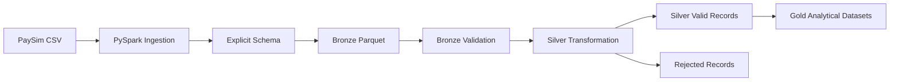

# Financial Transactions Data Pipeline

End-to-end data engineering pipeline for financial transaction data using Python, PySpark, SQL, and a Medallion Architecture, progressively extended with Airflow and cloud services.

## Dataset Overview

The project uses the PaySim synthetic financial transactions dataset.

Dataset source:
[PaySim - Synthetic Financial Datasets For Fraud Detection (Kaggle)](https://www.kaggle.com/datasets/ealaxi/paysim1)

The Dataset simulates financial transactions and includes types, amount, origin and destination account balances, and fraud indicators.

### Initial Profiling

The raw dataser is not included in this repository.

- 6,362,620 transactions
- 11 columns
- 5 transaction types
- No missing values detected
- No duplicated rows
- 8,213 fraudulent transactions
- Fraud occurs only in `TRANSFER` and `CASH_OUT` transactions
- Only 16 transactions are marked as `isFlaggedFraud`
- Transaction steps range from 1 to 743

## Current Architecture



## Bronze Layer

The Bronze layer preserves the original PaySim transaction data while converting the source CSV into Parquet format for more efficient analytical processing.

Current Bronze pipeline:

- Reads the raw PaySim CSV using PySpark
- Applies an explicit schema
- Preserves all source records
- Writes the dataset in Parquet format
- Reads the Bronze dataset back for validation
- Confirms that all 6,362,620 source transactions were preserved

No cleaning or business-rule transformations are applied at this stage.

## Silver Layer

The Silver layer is responsible for producing clean, validated, and enriched transaction data from the Bronze dataset.

Current Silver processing:

- Validates transaction types
- Validates required fields
- Rejects negative transaction amount
- Separates valid and rejected records
- Removes fully duplicated valid records
- Derives transaction_day and transaction_hour
- Stores valid and rejected datasets separetely in Parqut
- Validates the persisted Silver output

The Silver layer will read exclusively from the Bronze layer rather than directly from the raw CSV, preserving a clear processing lineage.

## Gold Layer

The Gold layer will contain analytical datasets derived from validated Silver data.

Planned analytical outputs include:

- Transaction volume by type
- Fraud count and fraud rate by transaction type
- Daily transaction summaries
- Transaction amount statistics
- Customer activity summaries
- Business-ready datasets for SQL and BI consumption

The Gold layer will be designed for analytical consumption rather than raw transaction processing.

## Project Structure

```text
financial-transactions-data-pipeline/
│
├── data/
│ ├── raw/
│ ├── bronze/
│ ├── silver/
│ └── gold/
│
├── src/
│ ├── ingestion/
│ │ ├── inspect_data.py
│ │ └── bronze_ingestion.py
│ │
│ ├── validation/
│ │ └── validate_bronze.py
│ │
│ ├── transformation/
│ │
│ └── analytics/
│
├── notebooks/
├── sql/
├── tests/
├── docs/
│
├── .gitignore
└── README.md
```

## Roadmap

- [x] Initial data profiling
- [x] Raw data ingestion
- [x] Explicit Spark schema
- [x] Bronze layer
- [x] Parquet storage
- [x] Bronze validation
- [x] Silver data quality rules
- [x] Silver transformations
- [x] Rejected-record handling
- [ ] Gold analytical datasets
- [ ] Spark SQL analytics
- [ ] Dimensional modeling
- [ ] Apache Airflow orchestration
- [ ] AWS Data Lake
- [ ] dbt transformations
- [ ] BI / analytical consumption

## Technology Stack

### Current

- Python
- Pandas
- PySpark
- Apache Spark
- Parquet
- Git

### Planned

- Spark SQL
- Apache Airflow
- dbt
- AWS S3
- AWS Glue
- AWS Athena
- Databricks
- Power BI

## Data Flow

```text
PaySim CSV
 ↓
Raw
 ↓
PySpark Ingestion
 ↓
Bronze Parquet
 ↓
Bronze Validation
 ↓
Silver Validation & Transformation
 ├── Valid Records
 └── Rejected Records
 ↓
Gold Analytical Datasets
 ↓
SQL / BI / Analytics
```

## Development Approach

The project is being developed incrementally.

Each stage introduces a new data engineering concept while preserving clear separation of responsibilities between ingestion, validation, transformation, and analytics.

The initial local implementation will later be extended with orchestration, cloud storage, distributed processing services, and analytical consumption tools